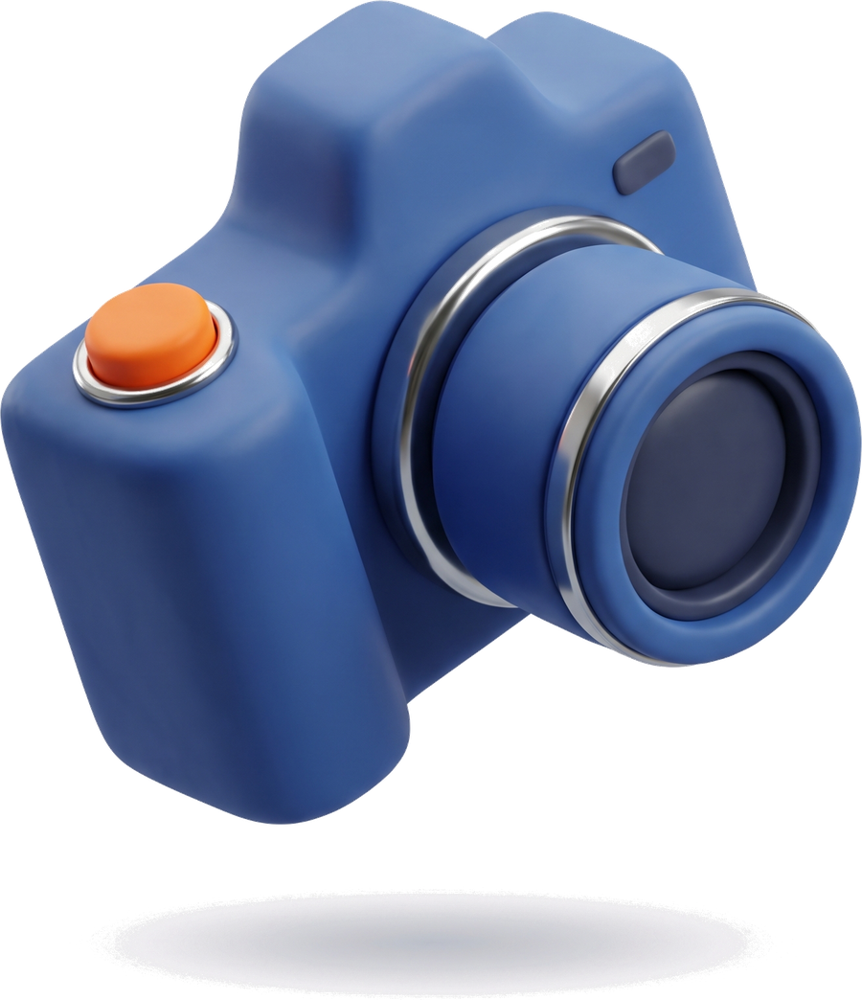

# 把复杂的东西，讲得更有趣

> 一套适合设计、创意和年轻化产品的 3D 卡通公众号排版示例。

很多内容不是不值得看，而是**第一眼没有记忆点**。

好奇果冻 3D 的方法很简单：用一个有性格的视觉锚点打开文章，用短段落解释观点，再用少量黏土物件把抽象概念变成可以记住的东西。

## 01 · 先建立一个视觉锚点

一个章节只需要一个 hero。相机代表记录，手柄代表互动，植物代表生长。素材不是装饰，而是帮助读者快速进入语境的线索。

<section style="background:#FFFFFF;padding:20px 18px;margin:24px 4px;border:1px solid #DCE8F2;"><b style="display:block;color:#425FC9;font-size:16px;line-height:1.5;">01 · 先建立一个视觉锚点</b>
让一件物品承担记忆点，让正文负责解释。不要把五个没有关系的玩具同时放上来。
</section>

## 02 · 再分配颜色角色

颜色不是背景填空，而是信息层级：果冻蓝负责空间，珊瑚橙负责动作，柠檬黄负责提示，薄荷绿负责轻松感，深墨色负责阅读。

<blockquote>每一页的颜色，都应该知道自己为什么在这里。</blockquote>

## 03 · 留一点呼吸

黏土物件很可爱，但不能让它们占满整篇文章。保留空白，读者才看得见结构；保留短句，读者才愿意继续滑。

<section style="background:#F6C66B;padding:26px 20px;margin:34px 4px;text-align:center;"><b style="display:block;color:#151A22;font-size:20px;line-height:1.5;">下一篇，继续玩</b>
小耳 · 用 AI 做点好玩的
</section>
